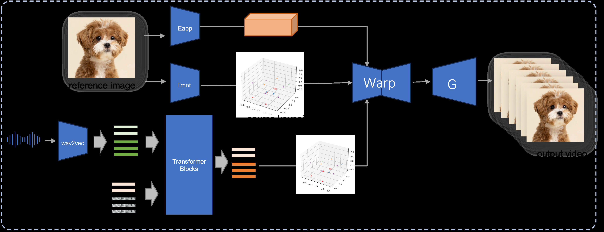
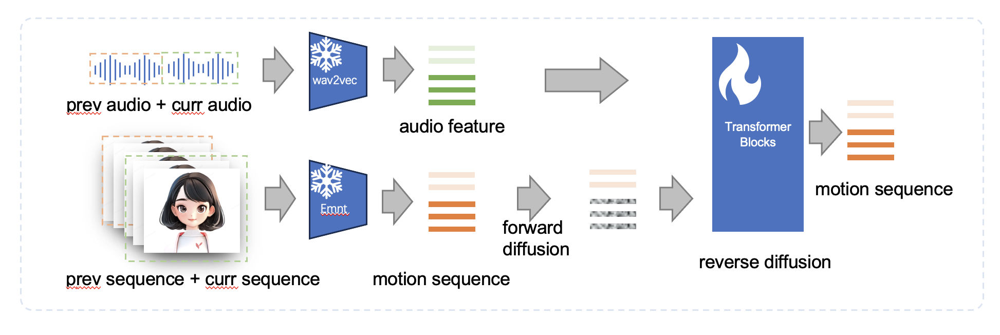

> - github代码：[jdh-algo/JoyHallo: JoyHallo: Digital human model for Mandarin](https://github.com/jdh-algo/JoyHallo?tab=readme-ov-file)

---

## JoyVASA: Portrait and Animal Image Animation with Diffusion-Based Audio-Driven Facial Dynamics and Head Motion Generation

<sup>1</sup> JD Health International Inc.    <sup>2</sup> Zhejiang University   

## Abstract

Audio-driven portrait animation has made significant advances with diffusion-based models, improving video quality and lipsync accuracy. However, the increasing complexity of these models has led to inefficiencies in training and inference, as well as constraints on video length and inter-frame continuity. In this paper, we propose JoyVASA, a diffusion-based method for generating facial dynamics and head motion in audio-driven facial animation. Specifically, in the first stage, we introduce a decoupled facial representation framework that separates dynamic facial expressions from static 3D facial representations. This decoupling allows the system to generate longer videos by combining any static 3D facial representation with dynamic motion sequences. Then, in the second stage, a diffusion transformer is trained to generate motion sequences directly from audio cues, independent of character identity. Finally, a generator trained in the first stage uses the 3D facial representation and the generated motion sequences as inputs to render high-quality animations. With the decoupled facial representation and the identity-independent motion generation process, JoyVASA extends beyond human portraits to animate animal faces seamlessly. The model is trained on a hybrid dataset of private Chinese and public English data, enabling multilingual support. Experimental results validate the effectiveness of our approach. Future work will focus on improving real-time performance and refining expression control, further expanding the framework's applications in portrait animation.

## Method



**Inference Pipeline of the proposed JoyVASA.** Given a reference image, we first extract the 3D facial appearance feature using the appearance encoder in LivePortrait, and also a series of learned 3D keypoints using the motion encoder. For the input speech, the audio features are initially extracted using the wav2vec2 encoder. The audio-driven motion sequences are then sampled using a diffusion model trained in the second stage in a sliding window fashion. Using the 3D keypoints of reference image, and the sampled target motion sequences, the target keypoints are computed. Finally, the 3D facial appearance feature is warped based on the source and target keypoints and rendered by a generator to produce the final output video.



**Training process of the audio-driven motion sequence generation.** The audio feature and real motion sequences are first extracted with the frozen wav2vec2 and the frozen motion encoder in Liveportrait. Then a diffusion transformer model is trained to sample the clean motion sequence from noise.

## Visualization Results

  


## Comparison with Existing Methods

###### Table 1. Comparison with existing methods on the celebv-HQ test dataset.

| Method | IQA (%) ↑ | VQA (%) ↑ | Sync-C ↑ | Sync-D ↓ | FVD-25 ↓ | Smooth (%) ↑ |
| --- | --- | --- | --- | --- | --- | --- |
| EchoMimic | 64.46 | 68.85 | 4.60 | 13.90 | 904.07 | 99.44 |
| Aniportrait | **74.85** | **78.00** | 1.98 | **13.28** | **623.00** | **99.66** |
| Hallo | 68.83 | 72.95 | 6.25 | 14.05 | 558.96 | 99.47 |
| JoyHallo | 69.15 | 74.00 | **6.36** | 14.23 | 755.61 | 99.38 |
| Ours | 68.97 | 72.42 | 4.85 | 13.53 | **459.04** | 99.60 |

###### Table 2. Comparison with existing methods on Openset dataset.

| Method | IQA (%)↑ | VQA (%) ↑ | Sync-C ↑ | Sync-D ↓ | Smooth (%) ↑ |
| --- | --- | --- | --- | --- | --- |
| EchoMimic | 75.66 | 82.73 | 4.12 | **13.79** | 99.20 |
| Aniportrait | **81.84** | **87.62** | 2.67 | 14.09 | **99.55** |
| Hallo | 75.37 | 83.85 | 5.39 | 13.91 | 99.33 |
| JoyHallo | 73.87 | 84.09 | **5.91** | 14.11 | 99.32 |
| Ours | 71.45 | 77.78 | 5.72 | 14.01 | 99.48 |

## BibTeX

```
@misc{cao2024joyvasaportraitanimalimage,
    title={JoyVASA: Portrait and Animal Image Animation with Diffusion-Based Audio-Driven Facial Dynamics and Head Motion Generation}, 
    author={Xuyang Cao and Guoxin Wang and Sheng Shi and Jun Zhao and Yang Yao and Jintao Fei and Minyu Gao},
    year={2024},
    eprint={2411.09209},
    archivePrefix={arXiv},
    primaryClass={cs.CV},
    url={https://arxiv.org/abs/2411.09209}, }
            
```