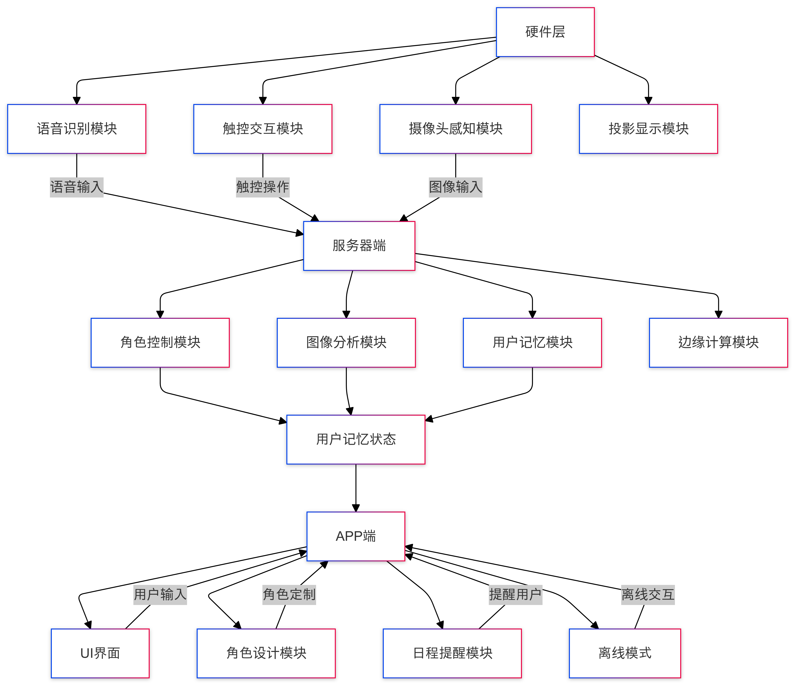
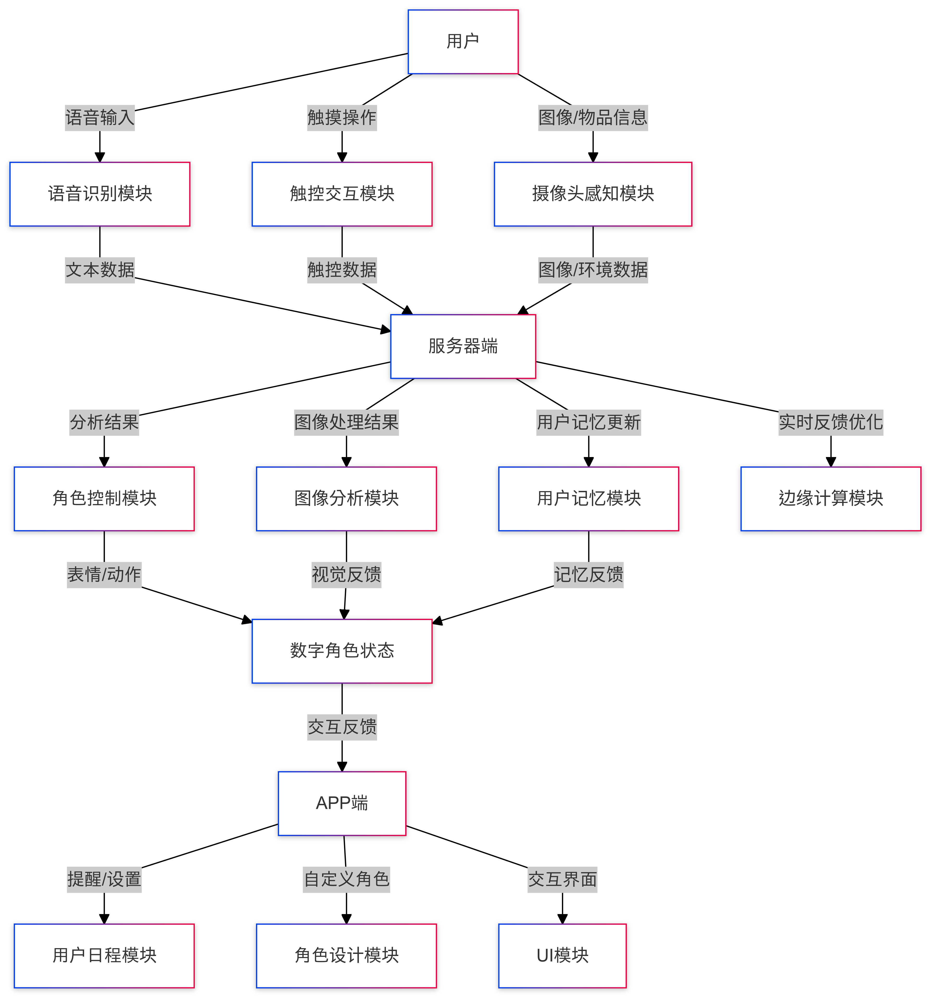
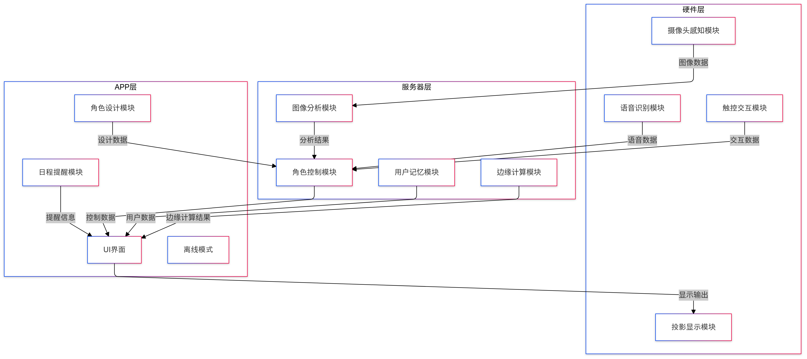
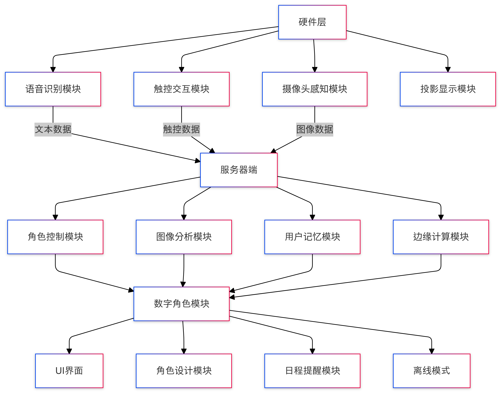
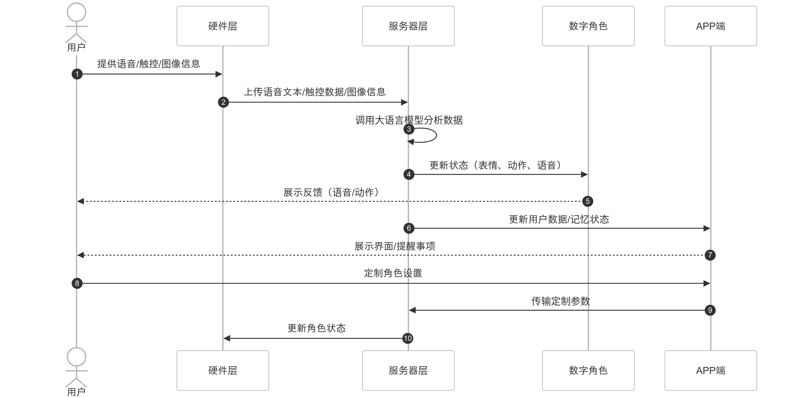

> 帮助技术团队、产品设计师、以及相关干系人全面理解产品架构，并优化后续的开发与设计过程。针对不同的需求，应当采用不同的展示方式，有以下几种参考：

---
### 1. **系统架构图 (System Architecture Diagram)**

- **适用场景：** 展示整个系统的组件与交互关系，适用于全局理解系统架构。
    
- **内容：**
    
    - 主要分为硬件层、服务器端和 APP 端，每个层次的模块和功能。
    - 显示硬件与服务器端之间的通信方式（如 API 请求），以及服务器端与 APP 端的交互。
    - 描述各组件如何协同工作，数据流向如何。
- **绘制工具：** Lucidchart、Microsoft Visio、Draw.io
    
- **示例布局：**
    
    - 硬件层：语音识别模块、触控交互模块、摄像头感知模块、投影显示模块。
    - 服务器端：数据处理模块、角色控制模块、图像分析模块、用户记忆模块、边缘计算。
    - APP端：UI界面、角色设计模块、日程提醒模块、离线模式。

---

### 2. **数据流图 (Data Flow Diagram, DFD)**

- **适用场景：** 展示数据在不同模块之间的流动和处理，清晰地呈现系统中各个处理过程与信息流。
    
- **内容：**
    
    - 显示硬件层如何获取用户输入（语音、触摸、图像），这些数据如何流向服务器端进行处理，再返回到 APP。
    - 数据如何从服务器端传递至 APP，进行角色交互与记忆管理。
    - 强调每个模块的输入、输出、数据处理过程。
- **绘制工具：** Lucidchart、Draw.io、Microsoft Visio、Balsamiq
    
- **示例布局：**
    
    - 数据流从硬件传入（如语音文本、摄像头数据）到服务器，经过处理后输出（如角色表情、动作、语音反馈）到 APP。
    - 交互数据如角色动作、用户记忆流向不同模块。

---

### 3. **分层架构图 (Layered Architecture Diagram)**

- **适用场景：** 展示系统的分层结构，强调系统各层的职责和功能。
    
- **内容：**
    
    - 清晰划分硬件层、服务器端层和 APP 层，显示每一层的主要功能和模块。
    - 每个层次之间的交互和数据流动。
    - 可以在每一层之间标明通信协议（如 REST API、WebSocket 等）。
- **绘制工具：** Lucidchart、Microsoft Visio、Draw.io
    
- **示例布局：**
    
    - 硬件层 → 服务器层 → APP 层，每层都有独立的子模块，箭头表示数据流。
    - 显示每层之间的接口（如用户输入、指令输出）。

---

### 4. **组件图 (Component Diagram)**

- **适用场景：** 用于展示系统中各个组件和子模块之间的关系，清晰划分不同功能块和它们之间的交互。
    
- **内容：**
    
    - 描述硬件、服务器、APP 各自的模块化组件（如语音识别、触控模块、数据存储等），并指出它们之间的依赖关系。
    - 展示每个组件的功能和其交互方式。
- **绘制工具：** Lucidchart、Draw.io、Enterprise Architect
    
- **示例布局：**
    
    - 硬件层模块与服务器端之间、服务器端与 APP 之间的组件关系。
    - 各模块之间的通信方式，如服务器通过 API 调用硬件、传输数据到 APP。

---

### 5. **时序图 (Sequence Diagram)**

- **适用场景：** 展示系统的动态行为，特别是在交互中各模块之间的时间顺序。
    
- **内容：**
    
    - 显示硬件、服务器和 APP 端如何在时间轴上交互，实时响应用户输入，生成反馈。
    - 展示不同事件（如用户语音输入、角色反馈）的顺序，以及各个模块之间的数据传输和动作触发。
- **绘制工具：** Lucidchart、Microsoft Visio、Draw.io
    
- **示例布局：**
    
    - 用户语音输入 → 语音识别 → 服务器处理 → 角色反馈 → APP 显示。
    - 每个步骤中的数据流和响应时间（渐进式反馈等）可以标注。

---

### 6. **原型图 (Wireframe)**
> 👉[APP原型图](APP原型图.md)

- **适用场景：** 针对 APP 端界面设计，展示用户界面的布局和交互设计。
    
- **内容：**
    
    - 设计数字角色自定义界面、日程提醒界面、动作设计界面等。
    - 展示用户与数字角色交互的流程和界面响应。
- **绘制工具：** Figma、Balsamiq、Sketch
    
- **示例布局：**
    
    - APP 主界面，展示数字角色、菜单、用户设置选项等。
    - 不同视图（角色视图、控制面板、日程管理界面）切换方式。

---

### Summary：

- **系统架构图** 展示全局结构；
- **数据流图** 和 **分层架构图** 展示数据流和层级关系；
- **组件图** 展示模块间关系；
- **时序图** 展示用户交互的实时处理过程；
- **原型图** 展示 APP 端具体的界面和用户操作流程。

